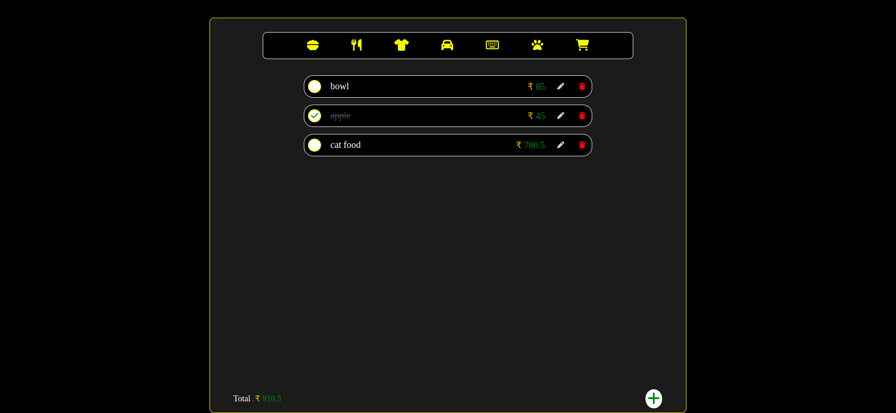
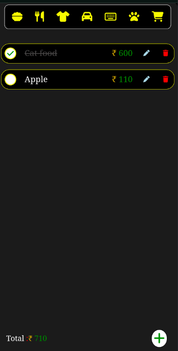
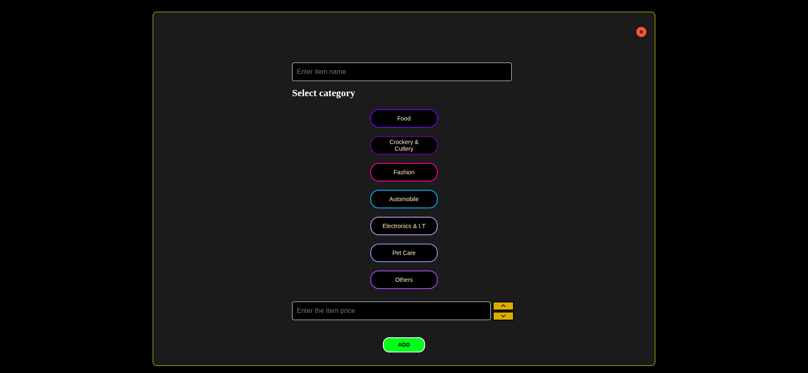
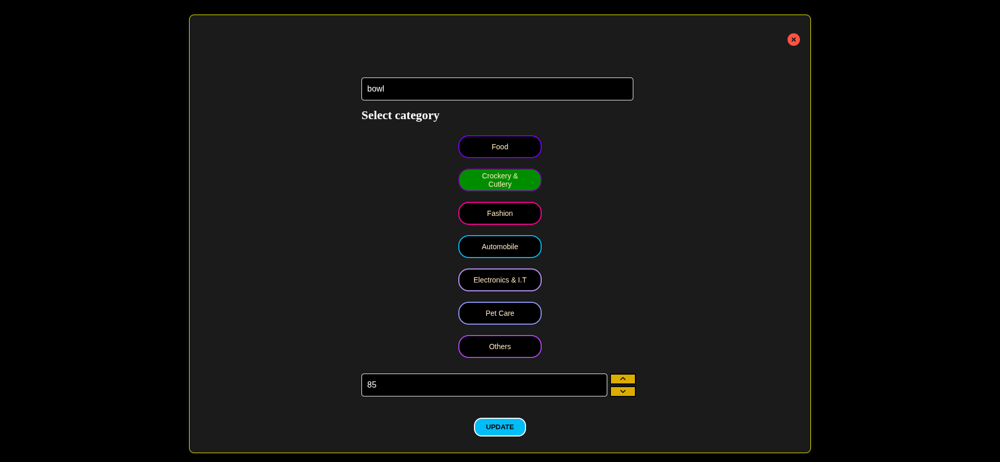

# 🛒 Smart Shopping List

A simple and responsive web application that helps you manage your shopping list.  
Built with **HTML**, **CSS**, and **JavaScript**.

---

## 🚀 Features
- ➕ Add products  
- ✏️ Update products  
- ❌ Remove products  
- 💾 Persistent storage using **Local Storage**  
- 📱 Responsive design for mobile and desktop  

---

## 📸 Screenshots

### Main View


### Mobile View



### Add Product Modal


### Update Product Modal


### View product according to category


---

## 🌐 Live Demo
👉 [Click here to try it out](https://your-username.github.io/your-repo-name/)  

---

## 🛠️ Installation & Setup
1. Clone the repository:
   ```bash
   git clone git@github.com:edwinisac/smart-shopping-list.git
